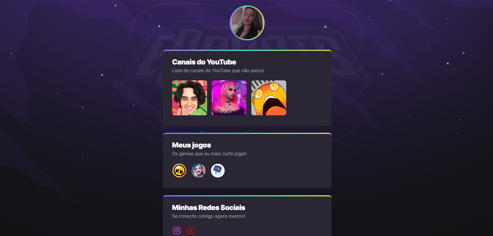

# NLW eSports

>Trilha Explore

O NLW eSports é um aplicativo criado para compartilhar e conectar interesses relacionados ao universo dos esportes eletrônicos. Ele permite que os usuários mostrem seus canais favoritos do YouTube, jogos preferidos e redes sociais em um só lugar.

[Click aqui para acessar](https://samilisbrito.github.io/nlw/)

## Tecnologias

- HTML
- CSS
- Git e Github

## Contato
samilisbrito.ufra@gmail.com
